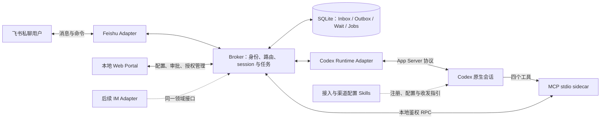
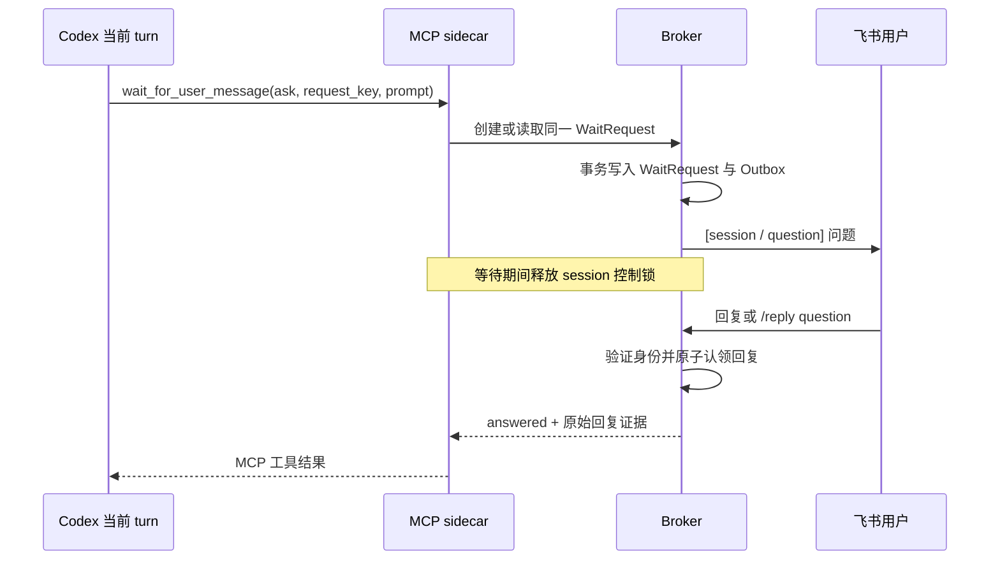

# 架构设计

版本：v0.2 · 2026-09-26 · 状态：待实现、待运行时验证。

## 1. 目标与默认假设

用户在一个 IM 私聊中管理多个 Codex 会话。Agent 在已有会话里调用 MCP 注册自己，并主动联系该会话绑定的用户。MCP 的等待调用把用户回复带回原调用栈。

首期新增本地 Web Portal、渠道配置 MCP/Skill 和首次使用审批。Chat new、受管新实例和对应 release 生命周期留到后续阶段。

默认部署在用户的 Windows 电脑上，单个 Broker、SQLite 持久化、一个本地管理员。首个 IM Adapter 为飞书应用机器人；领域模型预留多个 IM 账户、租户和用户。每条注册都具有明确的 owner。

首期对话载荷为文本，平台原始消息 ID、引用关系和发送者身份始终保留。附件、群聊、消息卡片作为 Adapter 的后续能力扩展。

Claude Channels 与 Copilot Extension 作为[后续调研](research/agent-host-integration.md)保存，首期 Runtime Adapter 聚焦 Codex。

## 2. 组件与进程

| 组件 | 责任 |
| --- | --- |
| Broker | 认证、授权策略、渠道配置、会话目录、当前选择、入站分类、等待解析、出站投递、取消、审计 |
| Local Web Portal | 本机管理员登录、渠道配置、凭据录入、连接测试、首次审批、持久授权管理 |
| IM Adapter | 平台登录、消息规范化、投递、引用关系、限流与重试信息 |
| Runtime Adapter | 附着已有原生会话、输入投递、事件订阅、状态与归属任务取消 |
| MCP sidecar | 暴露四个工具，把已验证客户端身份和运行上下文附到本地请求中 |
| Skills | 引导 Agent 注册、渠道配置、Web 审批、发送和等待回复 |
| SQLite | 所有需要在重启后保持一致的业务状态 |

Broker 与飞书长连接独立于 Codex 进程。MCP sidecar 可以随宿主退出；等待问题和消息记录保存在 Broker 数据库中。每个飞书应用默认由单个 Adapter 实例消费事件。

内部 Broker RPC 使用回环 HTTP + 每客户端受限凭据；Web Admin 使用独立登录权限域。MCP 第一版采用 stdio。本地凭据只证明客户端身份，实际操作权由 Web 批准的 Grant 决定。模型参数携带公开资源 ID。

技术建议：TypeScript、Node.js 22 LTS、SQLite、官方 MCP TypeScript SDK、飞书官方 Node SDK，Portal 使用同源的轻量 Web 页面。依赖版本在兼容性验证后锁定。受管 Job Object launcher 与 new 在后续阶段实现。

## 3. 身份模型：把五种 ID 分开

| 对象 | 主键/作用 |
| --- | --- |
| Principal | `principal_id`：本地授权用户；关联平台、bot 账户、租户、平台用户 ID |
| Conversation | `conversation_id`：一个具体私聊入口；唯一键为平台 + bot 账户 + 租户 + chat ID |
| Session | `session_id`：本项目生成的 UUID；用户看到稳定短 ID 和标题 |
| Native thread | `agent + agent_home_id + native_thread_id`：可跨进程恢复的原生上下文身份 |
| Wait request | `request_id`：一次问题/回复关联，固定到 session、用户和原始私聊 |

`session_id` 与原生 thread 的映射在建档后保持稳定。`runtime_id` 标识当前承载进程实例，恢复时可以变更。原生恢复返回其他 thread 时，系统进入校验错误并保留原记录。跨 Agent 的新会话使用新的 Session 行。

首期 Session 来自已验证的现有 native identity。原生恢复 ID 使用 `thread.id`，`thread.sessionId` 单独作为 session tree 关联信息。

`ConversationSelection(conversation_id, principal_id, active_session_id, revision)` 只是私聊界面的当前选择。切换时原子增加 revision。每条入站消息在接收事务中固化 `target_session_id`，后续任务按固化结果执行。

`SessionRoute(session_id, conversation_id, principal_id)` 明确授予该会话向哪个私聊发消息。首期一个 session 有一个 owner 和一个默认私聊路由；后续多平台路由需要用户明确关联。

短 ID 在 owner 可见的范围内解析，存在重名时列出候选。数据库、MCP 和任务事件使用完整 ID。

## 4. 用户审批与注册

### 4.1 首次使用审批

1. 管理员在本地 Portal 配置并启用飞书渠道；Agent 也可申请经授权的渠道配置。
2. 首次 IM 消息或 Agent 渠道操作，按真实主体和具体范围建立 pending AccessRequest。
3. 管理员在 Web 查看平台 open ID/租户，或已验证的 local client 身份，选择范围并批准。
4. 事务持久化 Grant 与审计；IM 用户获得如 `personal-feishu` 的 connection alias。
5. 后续每次请求、实际任务派发和出站发送重新读取有效授权，重启后继续使用同一 Grant。

首次被拦截的 IM 任务由用户重新发送。配对证据服务于身份确认，Web 决策产生操作授权。账号显示名称仅用于展示。完整方案见 [Portal 与审批](portal-and-access.md)。

### 4.2 从已有 Codex CLI 注册

Skill 调用 `register`，Broker 执行：

1. 校验 MCP sidecar 的本地身份和 runtime descriptor。
   同时校验该 Agent 客户端的注册权限、目标 IM 用户的有效访问 Grant 以及渠道身份版本。
2. 从受信 runtime 上下文解析原生 thread；Agent 传入的 `native_thread_id` 作为一致性校验候选。
3. 通过目标 App Server 读取 thread，验证 cwd、运行实例身份和注册者所有权。
4. 找到或登记稳定 Session，绑定已批准 connection，返回完整 ID、短 ID、停止范围和当前状态。
5. 默认保留用户当前选择；用户明确请求激活时才切换私聊指向。

候选 `CODEX_THREAD_ID`、当前目录、进程号都需要与 App Server 信息交叉验证。MCP `initialize` 标识传输客户端，业务上的 Codex thread 由独立的运行上下文证明。

runtime descriptor 的根 thread 由已授权的本地附着流程核验并记录，包含 runtime ID、Agent home 身份、endpoint 引用和启动 generation。相同 App Server 中出现新根 thread 后，需要重新建立可验证的描述记录；子 Agent 的工具调用归属到已登记的根任务。

已有 CLI 接入路径是：本地用户登记可访问的 App Server → Skill 触发 MCP 注册 → 注册器核对真实 thread。是否能从当前 CLI 环境可靠获得 thread 身份，列为 P0 验证项；注册失败时返回具体缺项。

### 4.3 渠道配置与后续新建

首期 `configure_im_channel` 将 Agent 的配置申请交给统一 ChannelConfigurationService 与 AccessPolicy。Web 首次审批完成后，按 scope、revision 和渠道身份执行配置、验证或启停。

Chat new 与托管创建的方案保留在[后续 Session 生命周期](session-lifecycle.md)。

## 5. Codex 运行模式

### 首期：Attached，已有 CLI 接入

- 连接用户明确登记的 App Server 和 thread，保留原生历史及桌面/终端所有权。
- 停止能力通过 capability probe 和资源归属验证，返回 `tracked_resources` 或 `owned_process_tree`。
- 强制进程树退出仅用于验证为该 Session 独占的实例。
- 达到完整停止验收门槛后，才将该附着类型标记为 full-control；其余记录明确展示已验证的控制范围。

用户在本地启动或恢复 Codex，然后通过 Skill/MCP 注册。已退出的宿主显示 offline，由用户原生恢复并重新登记当前 runtime。原生 history 和 home 保持原样。

### 后续：Managed 与新建/释放

new、独立受管实例、空闲回收和 release 交接，作为单独阶段完成。当前 Adapter 聚焦已有会话，扩展接口在相应阶段加入。

## 6. 入站路由与私聊多 session

接收飞书事件后，Adapter 验证私聊类型和真实发送者。AccessPolicy 先判断授权；pending 主体只建立限量审批元数据，有效授权的消息进入 Inbox。事务完成即返回平台回调；Agent 执行在后台处理。[S3]

分类优先级：

1. **控制命令**：切换、列表、状态、停止；验证 scope 后由 Broker 直接处理。
2. **明确回复**：引用某条问题或 `/reply <request_short_id> <text>`，定位该问题的原始 Session。
3. **显式任务**：`/send <session_short_id> <text>`，排入指定 Session 的新任务。
4. **普通消息**：固定到当前选中的 Session；该 Session 存在可匹配等待请求时优先完成等待，否则创建新任务。
5. **缺少当前选择**：返回已授权的会话选择或本地注册指引。

关键规则：

- 一个 session 同时只有一个开放的用户等待请求；不同 session 可分别等待。
- 切换 session 后，引用旧问题仍回复旧 session；普通消息按新的当前选择处理。
- `/switch` 保留其他 Session 正在执行的工作。
- `/send` 明确表示一个新任务，避免把新需求解释为问题的答案。
- 迟到的旧问题回复返回问题已结束的提示，并保留审计；重新发起任务使用 `/send`。
- session 标题、短 ID 和问题短 ID 随出站消息展示，便于从一个私聊识别多个任务。

相同 session 的任务按队列顺序执行。相同工作目录的修改任务默认使用单个工作区租约，状态明确显示等待工作区的原因。

## 7. MCP 等待：发问题，再返回用户答案

用户回复通过工具结果返回当前 turn。等待流程使用独立 WaitCoordinator，控制命令继续由 Broker 处理。

等待采用两级期限：单次工具阻塞默认 240 秒、最多 300 秒；问题有效期默认 30 分钟。Codex MCP 工具超时示例设为 360 秒，留出网络与清理余量；官方默认工具超时为 60 秒，需要在接入时显式调整。[S2]

单次阻塞到期返回 `waiting` 和相同 request ID。Agent 使用 `mode=resume`、同一个 request key 继续等待，问题保持原样。每次阻塞上限取本次超时与问题剩余期限的较小值；有效期届满返回 `expired`。MCP 连接中断后，答案保存在 WaitRequest，重连后可取回。

可靠性约束：

- 先写问题与 Outbox，再发送；相同 request key 只产生一次业务问题。
- 发送回执落库前的快速回复暂存在 Inbox，完成关联后再认领。
- 回复必须属于已授权的用户和原始私聊，且在问题有效期内。
- Grant 撤销、过期或渠道身份变更时，关联等待与未发送消息立即受最新策略约束。
- 一个入站消息只能被认领一次；回答等待和创建新任务使用互斥的数据库状态更新。
- 单个 request 仅允许一个活动 MCP waiter；重连使用新的 lease，使旧连接退出。
- 工具超时结束当次等待 lease；业务问题按自身 TTL 保留。
- `/stop` 原子取消业务问题。MCP transport cancellation 结束该调用；仍有效的问题保留供重连恢复，并受原有 TTL 约束。
- 外部发送结果不确定时标为 `delivery_unknown`，先核对投递结果，再决定重试。

## 8. 普通消息投递与结果回传

Broker 的任务队列承担持久化与取消。Runtime Adapter 根据原生运行状态选择立即启动 turn 或使用已验证的原生队列接口。[S1]

队列投递记录 `session_id + control_epoch + origin_message_id + native_queue_item_id/native_turn_id`。原生队列提交遇到网络断开时，任务先进入 `dispatch_unknown`，通过事件与队列查询核对后再继续。

发送路径有两种来源：

- Agent 调用 `send_message_to_user`：显式主动发言，可为 progress、notice 或 result。
- Broker 观察 IM 发起的 native turn 完成：该 turn 的 result 尚未进入 Outbox 时，补发可见的最终答复。

最终结果使用 `(session_id, native_turn_id, result)` 唯一投递键。显式发送和自动补发共享记录。CLI 自行启动的任务由 Agent 主动选择是否向 IM 通报；内部推理与原始工具日志保留在本地。

## 9. 停止当前 Session 的所有工作

`/stop` 在接收事务中锁定当前 Session ID，创建 StopOperation，并提升 `control_epoch`。

停止流程：

1. 关闭该 epoch 的新任务派发，取消本地排队任务、问题等待、定时唤醒和未投递的 Agent 消息。
2. 清理归属于根 thread 及派生 thread 的原生队列；停止原生 goal/持续任务。
3. 对所有可验证的运行中 turn 调用中断，观察结束事件。
4. 枚举并终止归属该任务树的后台 terminal、工具进程、派生 Agent 和带取消句柄的外部任务。
5. 逐项核对存活资源；具备明确授权、独占证明和可用进程控制能力时清理对应实例。其他情形报告具体残留。
6. 完成时发送结构化报告：已取消队列数、等待数、turn 数、进程数，以及残留或无法验证的任务。

只有确认覆盖范围内的工作均已结束，状态才进入 `stopped`。部分完成进入 `stop_incomplete` 并保留派发闸门。状态、已完成文件修改和历史继续保留。

所有旧 epoch 的发送、等待结果和迟到事件都经过 fencing 检查。新的用户任务同时验证当前 Grant 和活 runtime，再开启新 epoch。宿主已退出时，用户先从原生 CLI 恢复并注册；切换选择本身保持停止状态。

外部 API 已完成的副作用按历史记录保留；外部进行中作业通过已登记的取消句柄处理。远程请求状态不确定时，停止报告展示具体残留和后续动作。

**并发约束**：Broker 控制锁只覆盖短事务，等待 IM、模型运行和网络调用都在锁外执行。停止控制面独立于 Agent 自己的 MCP 调用和主任务队列。

## 10. 状态、持久化和重启恢复

首期 session 状态：`ready`、`running`、`waiting_user`、`waiting_approval`、`stopping`、`stopped`、`offline`、`error`、`stop_incomplete`。

历史状态来自已经登记的原生 thread。审批状态单独保存在 AccessRequest/Grant 中，区分首次业务访问审批与 Codex 原生执行审批。

session 状态来自 Runtime 事件、开放等待和停止操作的综合视图。`/status` 同时展示连接健康、任务数、等待、最后更新时间与停止覆盖范围。短时失联显示 `offline`，历史保留。

建议数据表：

| 表 | 关键字段与约束 |
| --- | --- |
| principals / agent_clients | 平台身份、owner、本地客户端身份及受限凭据 |
| channel_configs / credential_refs | 渠道版本、应用身份版本、脱敏配置及凭据后端引用 |
| access_requests / approval_decisions / access_grants | 待审批、Web 决策、持续 scope 与资源范围、撤销/过期 |
| admin_sessions | Web 管理员认证、有效期和 CSRF 状态 |
| conversations | 平台、bot 账户、tenant、chat ID 的复合唯一键 |
| sessions | UUID、owner、固定 native thread、当前 runtime、cwd、control_epoch、原生状态与连接健康 |
| session_routes | session 与授权 conversation、principal 的关联 |
| conversation_selections | 当前 session 与 revision |
| inbox | 平台消息 ID、原始证据、固定 target、路由状态；平台身份范围内去重 |
| jobs / native_dispatches | 原始消息、epoch、队列/turn ID、派发与执行状态 |
| wait_requests | session、request key、问题、截止时间、回复、waiter lease；开放等待唯一 |
| outbox / delivery_ledger | 幂等键、目的地快照、来源 session/turn、投递状态和平台回执 |
| runtime_resources | 原生 thread/进程/外部取消句柄与归属证明 |
| stop_operations / audit_events | 停止、授权执行、配置与各步骤安全审计 |

SQLite 事务建立 Inbox / Job / Wait / Outbox 的业务一致性。外部投递采用“至少一次尝试 + 幂等键 + 不确定状态核对”。平台发送接口的去重能力由 Adapter 声明，业务层据此选择重试策略。

重启后先恢复授权与渠道配置，再验证 runtime endpoint/PID generation，重建订阅和状态，按最新 Grant 核对等待、Outbox 与不确定派发，最后开放新任务。

## 11. 飞书 Adapter

- 使用应用机器人和官方 SDK 的长连接接收 `im.message.receive_v1`。[S3]
- 从事件提取 bot 账户、tenant、发送者 `open_id`、`chat_id`、`message_id`、引用信息和文本。
- 第一版将 `chat_type=p2p` 的用户身份交给 AccessPolicy，获得有效 Grant 后进入私聊 Router。
- 通过应用身份向已登记 `chat_id` 发送文本；发送 API 的客户端幂等字段在 P0 验证后映射到 Outbox key。[S4]
- 初始权限选择读取机器人单聊消息与以机器人身份发消息；实际权限名称和发布步骤在控制台逐项验收。
- 可选引用关系由 `reply_to_message_id` 规范化；有缺失时使用文本 `/reply` 关联。
- SDK 事件处理器只完成规范化与持久化，随后让后台任务处理 Agent 调用。

## 12. 可扩展性与安全

增加其他 IM 时，实现 `ImAdapter` 的身份、接收、发送、错误归类和 capabilities。平台差异留在 Adapter 中：引用方式、最大文本长度、主动发送窗口、幂等支持、编辑能力。核心 Router 使用统一 Conversation 和 Principal。

增加其他 Agent 时，实现身份核验、attach、dispatch、inspect、events 和 stop。新建和托管生命周期在后续阶段补充，Broker 按真实能力安排控制流程。

安全约束：

- 所有命令、会话列表、引用回复和 MCP 发送都校验当前 Grant、owner、route 与渠道身份版本。
- 工程路径通过本地 workspace alias 白名单解析；CLI 参数使用参数数组。
- 渠道密钥从 Portal 写入凭据后端；MCP 使用受限 credential_ref，日志记录脱敏引用。
- 原生审批维持 Codex 的权限边界；`wait_for_user_message` 返回普通回复证据，权限批准走专门的审批关联。
- 第一版 `/status` 能显示原生待审批请求；远程 `/approve`、`/deny` 作为后续显式审批功能实现。
- Runtime 的进程清理以句柄、创建时间和所属任务为依据。
- 用户输入、项目文件和 Agent 输出各自保留来源，引用文本作为上下文处理。
- Web 审批限定明确的客户端/平台用户、渠道、owner 和资源范围；扩大范围或改变应用身份需要新的授权记录。

## 13. 当前验证边界

本轮已检查本机 CLI、生成的普通/实验协议 schema、官方文档，并校验设计契约。App Server 双客户端、运行中 MCP 注册归因、飞书实发、等待长连接和完整停止，统一列入 P0/P1 的可执行验收。

本地生成的 schema 确认了 `thread/queue/*`、后台 terminal 管理属于实验接口；Adapter 需要按安装版本生成类型并显式开启相应 capability。具体方法与证据见 [依据与兼容性](references.md)。
